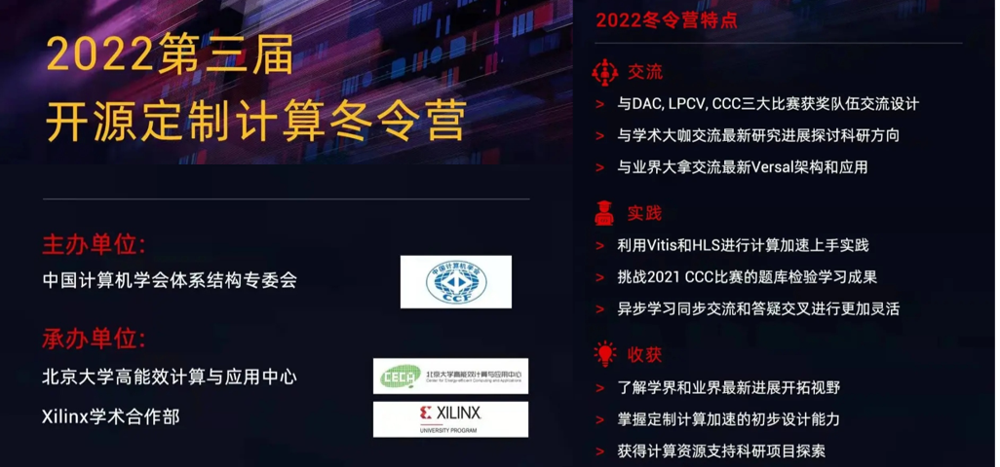

<!--# CCF TCARCH- Customized Computing Challenge!-->

AMD-Xilinx冬令营*由CCF体系结构专委会主办，北京大学高能效计算与应用中心与Xilinx学术合作联合承办。
北京大学，清华大学，计算所，浙江大学，北京工业大学，Xilinx等来自学术界工业界多位学者和资深工程师分享研讨了定制计算的前沿方向。
本次冬令营同时也介绍了Xilinx Adaptive Compute Clusters（XACC)，以下为XACC项目的链接：

<a href="https://xilinx.github.io/xacc/"><strong>Xilinx Adaptive Compute Clusters</strong></a>

**注：2022年4月18日开放报名和发布**

<a href="https://xupsh.github.io/ccc2021/upload.html"><strong>点击报名</strong></a>

## 历届冬令营
        

## 冬令营流程

---------------------------------------

Copyright&copy; 2022 AMD-Xilinx

