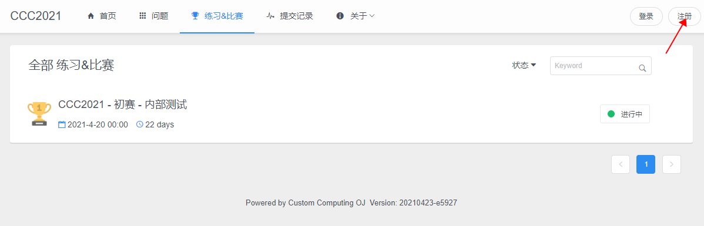
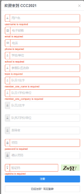

**2021年4月28日开放注册报名通道**

**2021年5月15日开放作品提交通道**

**2021年6月21日关闭作品提交通道**

# 作品提交

>注: 每队每天每题最多三次提交机会

## 注册流程

>注册入口：请点击导航栏右上角注册按钮，如下图所示
>

>
>注册注意事项： 
>1.按提示填入各项信息，确保信息无误。 
>2.其中队员2名字、队员2学校/单位以及指导老师为选填项，有则填上信息，无则空着。 
>3.其他选项为必填项。不填页面上会有提示。 
>4.密码长度在6-20之间。 
>5.验证码不区分大小写。 
>

## 提交作品流程

## 作品提交的入口如下：

[http://ccc2021.rieslab.cn:8008/](http://ccc2021.rieslab.cn:8008/)
